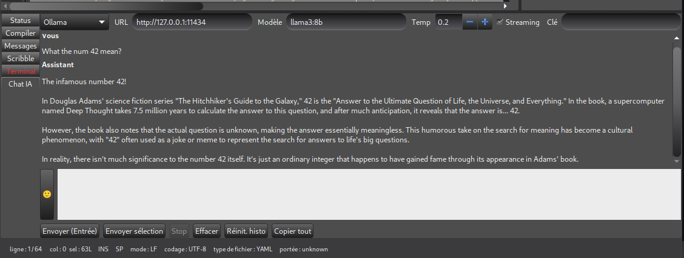

# AI Chat (Geany Plugin)

> Local AI chat inside Geany — streaming responses, send editor selection, stop, pretty code blocks (GtkSourceView), copy/insert into editor.

**Author:** GPT-5 Thinking (ChatGPT)  
**License:** MIT

**Languages:** [English](#english) · [Français](#français)

---

## English

### ✨ Features
- Chat pane in Geany's Message Window (bottom panel)
- **Streaming** replies (Ollama JSON-lines / OpenAI-compatible SSE)
- **Append editor selection** to the input box
- **Stop** ongoing generation
- Markdown **```fences```** with **syntax highlighting** (GtkSourceView)
- Heuristic language detection when fence lacks a `lang` hint
- Per-block **Copy** and **Insert into editor**
- **Copy all** preserves fenced code languages (```lang)
- **Clickable links** in messages (Markdown `[text](url)` and bare URLs)
- Visual **blockquotes** (`>`) with styling
- **Auto-scroll** during streaming
- Basic on-disk **preferences** (URL, model, temperature, streaming, API key)
- Light/Dark theme toggle (scoped to chat pane)
- **Model dropdown** with auto-fetch from API (+ manual entry)
- **System prompt presets**: create, rename, delete, and switch between saved prompts
- **Backend presets**: save and quickly switch between API configurations (URL, model, temperature, API key)
- **Export conversation** to Markdown file
- **Network settings**: configurable timeout and HTTP proxy
- **Links toggle**: enable/disable clickable URLs in messages
- **Keyboard shortcuts**: Enter to send, Escape to stop, Ctrl+Shift+C to copy all

---

### 📦 Dependencies (Debian/Ubuntu)
```bash
sudo apt update
sudo apt install -y   build-essential pkg-config   libgtk-3-dev libcurl4-openssl-dev   libgeany-dev libgtksourceview-3.0-dev
# Optional runtime:
#   ollama  (for local models)
```
> If your distro ships GtkSourceView 4, use `libgtksourceview-4-dev` and replace `gtksourceview-3.0` with `gtksourceview-4` in the Makefile.

---

### 🛠️ Build & Install
```bash
make
make install   # installs ai_chat.so to ~/.config/geany/plugins/
```
System-wide (path may vary by distro):
```bash
sudo mkdir -p /usr/lib/x86_64-linux-gnu/geany
sudo cp ai_chat.so /usr/lib/x86_64-linux-gnu/geany/
# or sometimes:
# sudo cp ai_chat.so /usr/lib/geany/
```

---

### 🚀 Use
1. Open Geany → **Tools → Plugin Manager** → enable **AI Chat (pro)**.  
2. Open the **Chat IA** tab in the bottom panel.  
3. Configure:
   - **Backend:** *Ollama* or *OpenAI-compatible*
   - **Base URL:** e.g. `http://127.0.0.1:11434` (Ollama) or your API host
   - **Model:** select from dropdown (click **↻** to refresh) or type manually
   - **Temperature, Streaming, API Key** (if needed)
4. Type your message and press **Enter** to send (**Shift+Enter** for newline).
5. Use **Send selection** to append the current editor selection into the input box.
6. Use **Context…** to manage system prompts:
   - Select a preset or "(Custom)"
   - **+** to create a new preset from current text
   - **−** to delete, **✎** to rename
7. In replies:
   - Code blocks have **Copy** & **Insert into editor** buttons.
8. **Stop** cancels the current request. **Reset history** clears memory (system prompt remains).

---

### ⚙️ Configuration
A config file is stored at:
```
~/.config/geany/ai_chat.conf
```
It keeps: backend, base URL, model, temperature, streaming flag, API key, dark theme, current system prompt, and all saved presets.

---

### 🩺 Troubleshooting
- **Plugin doesn’t show up**
  - Verify `ai_chat.so` is in `~/.config/geany/plugins/` (or the system plugin dir).
  - Make sure `libgeany-dev` and Geany (GTK3) are installed for your version.
- **“requires executable stack” linker warning**
  - The build uses hardening flags (`-Wl,-z,noexecstack -Wl,-z,relro -Wl,-z,now`).
- **Clicks in the chat try to open a file in Geany**
  - The chat UI swallows those events; if you still see “File not found”, ensure you’re on the latest build.
- **Weird escape sequences in replies (e.g., `\u003e`, `\"`)**
  - Handled: JSON strings are fully un-escaped in the stream.
- **HTTP errors**
  - Now include error codes and curl messages; check Base URL / model and credentials.
  - Switching API or model resets history to avoid mixed contexts.

---

### 🔐 Notes
- Requests are sent to your configured endpoint (local Ollama or remote API).
- No telemetry, no background network activity beyond your explicit prompts.

---

### 🗺️ Roadmap
- Project folder as knowledge base (RAG)
- Link hover style  

---

### 🤝 Contributing
PRs welcome! Please include:
- OS/distro, Geany version, GtkSourceView version (3 or 4)
- Steps to reproduce issues
- Minimal patches (keep GTK main-loop thread safety via `g_idle_add`)

---

### 📜 License
MIT — see `LICENSE`.

---

## Français

### ✨ Fonctionnalités
- Onglet de chat dans la **fenêtre de messages** de Geany (panneau bas)
- Réponses en **streaming** (JSON-lines Ollama / SSE OpenAI-compatible)
- **Ajouter la sélection** de l'éditeur dans la zone de saisie
- **Stop** pour annuler la génération
- **Blocs ```code```** avec **coloration syntaxique** (GtkSourceView)
- Détection heuristique du langage quand la fence n'indique pas `lang`
- Boutons par bloc : **Copier** & **Insérer dans l'éditeur**
- **Copier tout** préserve la langue des fences (```lang)
- **Liens cliquables** dans les messages (Markdown `[texte](url)` et URLs simples)
- **Blockquotes** (`>`) avec style visuel
- **Auto-scroll** pendant le stream
- **Préférences** sur disque (URL, modèle, température, streaming, clé)
- Bascule thème clair/sombre (portée à l'onglet de chat)
- **Liste déroulante des modèles** avec récupération depuis l'API (+ saisie manuelle)
- **Presets de prompts système** : créer, renommer, supprimer et basculer entre prompts sauvegardés
- **Presets de backends** : sauvegarder et basculer rapidement entre configurations API (URL, modèle, température, clé)
- **Export de conversation** en fichier Markdown
- **Paramètres réseau** : timeout et proxy HTTP configurables
- **Toggle liens** : activer/désactiver les URLs cliquables
- **Raccourcis clavier** : Entrée pour envoyer, Escape pour arrêter, Ctrl+Shift+C pour tout copier

---

### 📦 Dépendances (Debian/Ubuntu)
```bash
sudo apt update
sudo apt install -y   build-essential pkg-config   libgtk-3-dev libcurl4-openssl-dev   libgeany-dev libgtksourceview-3.0-dev
# Optionnel à l’exécution :
#   ollama  (pour modèles locaux)
```
> Si votre distribution fournit GtkSourceView 4, utilisez `libgtksourceview-4-dev` et remplacez `gtksourceview-3.0` par `gtksourceview-4` dans le Makefile.

---

### 🛠️ Compilation & Installation
```bash
make
make install   # installe ai_chat.so dans ~/.config/geany/plugins/
```
Installation système (le chemin peut varier) :
```bash
sudo mkdir -p /usr/lib/x86_64-linux-gnu/geany
sudo cp ai_chat.so /usr/lib/x86_64-linux-gnu/geany/
# ou parfois :
# sudo cp ai_chat.so /usr/lib/geany/
```

---

### 🚀 Utilisation
1. Ouvrir Geany → **Outils → Gestionnaire de plugins** → activer **AI Chat (pro)**.  
2. Ouvrir l’onglet **Chat IA** (panneau du bas).  
3. Paramétrer :
   - **Backend** : *Ollama* ou *OpenAI-compatible*
   - **URL** : ex. `http://127.0.0.1:11434` (Ollama) ou votre API
   - **Modèle** : sélectionner dans la liste (clic **↻** pour rafraîchir) ou saisir manuellement
   - **Température, Streaming, Clé API** (si besoin)
4. Saisir le message, **Entrée** pour envoyer (**Shift+Entrée** pour retour à la ligne).
5. **Envoyer sélection** ajoute la sélection de l'éditeur à la zone de saisie.
6. Bouton **Contexte…** pour gérer les prompts système :
   - Sélectionner un preset ou "(Personnalisé)"
   - **+** pour créer un nouveau preset à partir du texte actuel
   - **−** pour supprimer, **✎** pour renommer
7. Dans les réponses :
   - Les blocs de code ont **Copier** & **Insérer dans l’éditeur**.
8. **Stop** annule la requête en cours, **Réinit. histo** vide l’historique (le contexte système reste).

---

### ⚙️ Configuration
Fichier :
```
~/.config/geany/ai_chat.conf
```
Contient : backend, URL, modèle, température, streaming, clé API, thème sombre, prompt système actuel et tous les presets sauvegardés.

---

### 🩺 Dépannage
- **Le plugin n’apparaît pas**
  - Vérifiez `~/.config/geany/plugins/ai_chat.so` (ou le répertoire système).
  - Assurez-vous que `libgeany-dev` et Geany (GTK3) sont installés pour votre version.
- **Avertissement “executable stack”**
  - Le link inclut `-Wl,-z,noexecstack -Wl,-z,relro -Wl,-z,now`.
- **Cliquer dans le chat ouvre “Fichier non trouvé”**
  - Les clics sont neutralisés dans notre onglet ; mettez à jour si besoin.
- **Séquences d’échappement visibles (`\u003e`, `\"`)**
  - Géré : les chaînes JSON sont dés-échappées pendant le stream.
- **Erreurs HTTP**
  - Désormais avec codes et messages; vérifiez URL / modèle et clés.
  - Le changement d’API ou de modèle réinitialise l’historique pour éviter les contextes mélangés.

---

### 🔐 Notes
- Les requêtes partent vers l’endpoint configuré (Ollama local ou API distante).
- Aucune télémétrie, pas d’activité réseau hors envoi explicite.

---

### 🗺️ Feuille de route
- Dossier projet comme base de connaissances (RAG)
- Style de survol des liens  

---

### 🤝 Contribuer
PRs bienvenues ! Merci d’indiquer :
- OS/distro, version de Geany, version GtkSourceView (3 ou 4)
- Étapes de reproduction
- Patches minimalistes (respect des mises à jour UI via `g_idle_add`)

---

### 📜 Licence
MIT — voir `LICENSE`.
